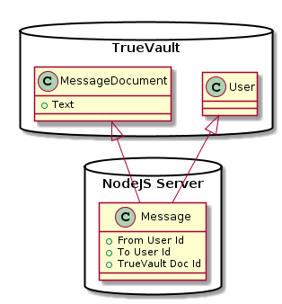
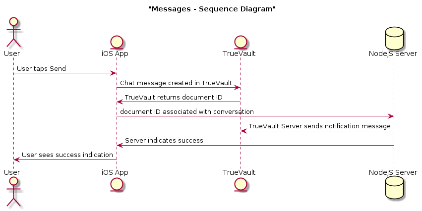

Introduction
============

This repo contains a simple iOS chat app. It demonstrates how to store sensitive data (username/password, phone number, chat messages) in TrueVault, while storing non-sensitive deidentified data in a traditional SQL server.

Architecture
============

Representing chat conversations is easiest in a relational database, but storing protected information (e. g. free text fields) is easiest in TrueVault. By splitting our data into protected data (chat messages, user information) and de-identified metadata, we get the best of both worlds. This sample application illustrates this approach by storing chat messages and user info in TrueVault, and everything else in a SQLite database:

As you can see, the Node JS server doesn't contain any protected information; it just contains opaque TrueVault IDs. However, since they're stored in a relational database it's trivial to write analytics queries that would be difficult or impossible with a document store.

Having the data split in this manner adds some complexity. When the user sends a chat message, the following events occur:

Note that the chat message never gets sent to the NodeJS server; only the document ID from TrueVault goes to the NodeJS server. Since the NodeJS server (and its backing SQLite database) never receive any sensitive information, it's easy to deploy securely.

This split/combine client-side logic is implemented in [SampleChatApp/HighLevelClient.swift](SampleChatApp/HighLevelClient.swift). TrueVault communication is handled by [SampleChatApp/TrueVaultClient.swift](SampleChatApp/TrueVaultClient.swift).

Running Locally
===============

To run the sample app on your computer, lay the following groundwork:

1. Configure Twilio
    1. Create a Twilio account
    1. Provision a Twilio number to use as the 'From' number when sending messages
    1. Create a restricted Twilio access key that can send SMSs
    1. Copy `template.env` to `.env` and insert the values you got earlier
    
1. Configure TrueVault
    1. Create a TrueVault account: [https://console.truevault.com/register](https://console.truevault.com/register)
    1. Create a vault to store the chat messages
    1. Create a group that only allows creating users
    1. Create a user, and add it to that group
    1. Generate a new API key for that user 
    1. Copy `Config.swift.template` to `Config.swift` and populate with the appropriate values
   

Then, start the NodeJS server:

    yarn
    node index.js
    
And finally, launch the iOS app via Xcode.
